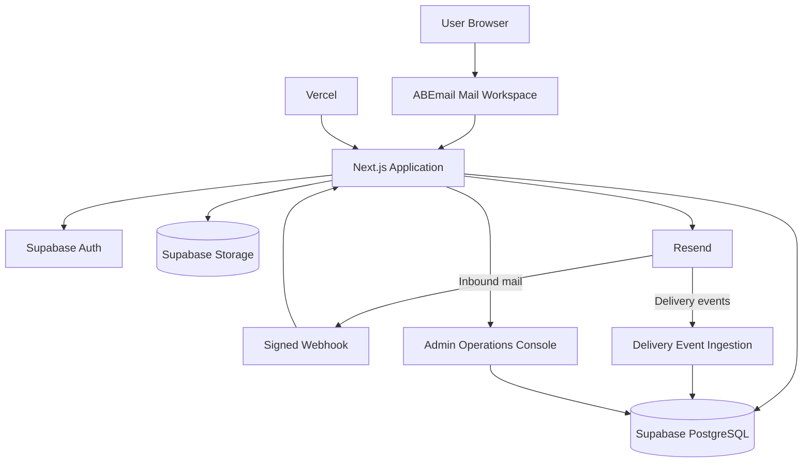

<a name="readme-top"></a>

<div align="center">


# ✉️ ABEmail Mail

### Organization-owned business email, built as a deployable product.

<p>
  
</p>

<p>
  <a href="https://mail.waste2light.com"></a>
  
  
  
  
  
  
</p>

<p>
  <strong>ABEmail Mail</strong> is a focused business email workspace for organizations that own their domain, control their mailboxes, and want a modern web-based mail experience without operating a traditional mail-server stack themselves.
</p>

</div>

---

## 🧭 What is ABEmail?

ABEmail Mail is an **organization-specific business email platform**.

The current deployment is built for **ABE Tech Lab / Waste2Light**, with two connected layers:

```text
┌─────────────────────────────────────────────────────────────┐
│                        ABEmail Mail                         │
├───────────────────────────────┬─────────────────────────────┤
│        Mail Workspace         │     Operations Console      │
│                               │                             │
│ Inbox / Sent / Search         │ Overview / Monitoring       │
│ Drafts / Attachments          │ Incidents / Security        │
│ Reply / Forward               │ Capacity / Users           │
│ Read / Star / Trash            │ Mailboxes / Subscription   │
│ Responsive UI                 │ Audit / Issue Reports      │
└───────────────────────────────┴─────────────────────────────┘
```

ABEmail is **not currently a multi-tenant Software as a Service (SaaS) platform**. The intended reuse model is one isolated deployment per organization.

---

## ✨ What has been built

### 📬 Mail workspace

- Inbox and mailbox navigation
- All Mail
- Sent / My Sent
- Starred
- Trash
- Read and unread state
- Mark all visible mail as read
- Message reading view
- Search and filtering
- Responsive desktop, tablet, and mobile layouts
- Mobile navigation drawer
- Controlled message scrolling

### ✍️ Composition and message actions

- New message composition
- Reply
- Reply All
- Forward
- Multi-recipient Reply All
- Safe quoted-message handling
- Attachment upload
- Attachment delivery
- Secure attachment access
- Draft creation, update, deletion, and autosave
- Duplicate-save protection for rapid autosave requests
- Attachment metadata preservation in drafts

### 📡 Email infrastructure

- Resend outbound delivery
- Resend inbound receiving
- Signed inbound webhook verification
- Supabase PostgreSQL persistence
- Delivery-event ingestion support
- Bounce, delay, failure, complaint, and suppression tracking
- Idempotent provider-event storage

### 🔐 Authentication and access control

- Supabase Authentication
- Protected routes
- Authenticated server-side application programming interfaces (APIs)
- Mailbox-scoped operations
- Server-side Admin authorization
- Organization-level Admin allowlist
- Row Level Security (RLS)
- Private attachment storage
- Administrative audit records

---

## 🛡️ ABE Tech Lab Operations Console

The current Waste2Light deployment includes an organization-level Admin console so the mail system can be operated as a real service.

```text
/admin
│
├── Overview
├── Monitoring
├── Incidents
├── Security
├── Capacity & Usage
├── Mailboxes
├── Users
├── Subscription
└── Audit Log
```

### Operations capabilities

- Overview dashboard
- Application and mail-flow monitoring
- Incident management
- User issue reporting
- System-event tracking
- Resend delivery monitoring
- Scheduled health checks
- Mailbox management
- User access management
- Subscription operations
- Administrative audit log
- P1 / P2 / P3 incident support
- Automatic incident detection from critical or repeated signals

Admin access uses the normal ABEmail authentication account. There is no separate Admin password.

```text
Normal login
     ↓
Authenticated Supabase user
     ↓
Server-side email allowlist check
     ↓
ABEMAIL_ADMIN_EMAILS
     ↓
/admin
```

---

## 🧠 Architecture



### ⚙️ Stack at a glance

<p align="center">
  
</p>

| Layer | Technology | Purpose |
| --- | --- | --- |
| Framework | Next.js | Web application, routing, server APIs |
| UI | React | Mail workspace and Admin interface |
| Language | TypeScript | Application code and type safety |
| Authentication | Supabase Auth | Identity and sessions |
| Database | Supabase PostgreSQL | Mail, drafts, events, Admin data |
| Storage | Supabase Storage | Private attachments |
| Email | Resend | Sending, receiving, webhooks, delivery events |
| Hosting | Vercel | Deployment and scheduled jobs |

---

## 🔄 Mail flow

### Incoming

```text
External sender
      ↓
Resend inbound receiving
      ↓
Signed webhook
      ↓
ABEmail webhook handler
      ↓
Validate + normalize
      ↓
Supabase PostgreSQL
      ↓
ABEmail mailbox
```

### Outgoing

```text
Compose / Reply / Forward
           ↓
Authenticated ABEmail API
           ↓
         Resend
           ↓
    External recipient
```

### Monitoring

```text
Application + mail events
          ↓
Monitoring layer
          ↓
Incidents / audit / alerts
          ↓
Admin Operations Console
```

---

## 🗺️ Product status

```text
Core mail product             ████████████████████  COMPLETE
Authentication                ████████████████████  COMPLETE
Send / receive                ████████████████████  COMPLETE
Attachments                   ████████████████████  COMPLETE
Drafts / autosave             ████████████████████  COMPLETE
Search                        ████████████████████  COMPLETE
Admin console                 ████████████████████  MERGED
Admin database                ████████████████████  APPLIED
Admin validation              ███████████████░░░░░  IN PROGRESS
Security hardening            ██████████░░░░░░░░░░  FOLLOW-UP
Gmail deliverability          ██████████░░░░░░░░░░  FOLLOW-UP
Automated tests               █████░░░░░░░░░░░░░░░  FOLLOW-UP
Web Push notifications        ███████████████░░░░░  PARKED
Cloudflare migration          ██░░░░░░░░░░░░░░░░░░  FUTURE
Commercial licensing model    ██░░░░░░░░░░░░░░░░░░  FUTURE
```

### Current branch model

```text
main
├── feature/security-hardening   # active unmerged security work
└── feature/web-push-v2           # parked Web Push work
```

Completed feature branches are merged and removed.

---

## 🚀 Local development

### Requirements

- Node.js 22+
- npm
- Supabase project
- Resend account and verified domain for real email testing

### Install

```bash
npm install
```

### Run locally

```bash
npm run dev
```

Then open `http://localhost:3000`.

### Production build

```bash
npm run build
```

> The repository currently exposes `dev`, `build`, and `start` scripts. A dedicated automated test command and dedicated TypeScript check command remain part of the hardening backlog.

---

## 🔑 Environment variables

Create a local environment file:

```bash
cp .env.example .env.local
```

### Application configuration

```text
NEXT_PUBLIC_SUPABASE_URL
NEXT_PUBLIC_SUPABASE_PUBLISHABLE_KEY
SUPABASE_SERVICE_ROLE_KEY

RESEND_API_KEY
RESEND_WEBHOOK_SECRET
RESEND_FROM_EMAIL

NEXT_PUBLIC_APP_URL
```

### Admin configuration

```text
ABEMAIL_ADMIN_EMAILS
CRON_SECRET
```

`ABEMAIL_ADMIN_EMAILS` defines the email addresses allowed to enter `/admin`.

`CRON_SECRET` authenticates scheduled health-check requests.

Never commit secrets, service-role credentials, webhook secrets, or private provider credentials.

---

## 🗄️ Supabase database

The production baseline uses ordered migrations:

```text
001_email_core.sql
002_correct_emmanuel_abah_email.sql
003_settings_notifications_billing.sql
004_email_drafts.sql
005_message_state.sql
006_attachments_storage.sql
007_admin_operations.sql
008_resend_delivery_events.sql
009_incident_alerts.sql
```

| Migration | Purpose |
| --- | --- |
| `001_email_core.sql` | Foundational mailboxes and message schema |
| `002_correct_emmanuel_abah_email.sql` | Mailbox address correction |
| `003_settings_notifications_billing.sql` | Settings, notification preferences, subscription data |
| `004_email_drafts.sql` | Draft persistence |
| `005_message_state.sql` | Message state operations |
| `006_attachments_storage.sql` | Private attachment storage and metadata |
| `007_admin_operations.sql` | Incidents, system events, reports, audit data |
| `008_resend_delivery_events.sql` | Provider delivery-event storage |
| `009_incident_alerts.sql` | Incident alert structures |

Apply migrations in order. Do not apply parked/future migrations unless the feature is explicitly activated.

---

## 📮 Resend setup

Each organization deployment needs its own Resend configuration.

Configure:

1. A verified sending domain
2. The sender address
3. A Resend API key
4. Inbound receiving
5. The ABEmail webhook endpoint
6. The webhook signing secret
7. The delivery events required by Admin monitoring

Current Waste2Light webhook:

```text
https://mail.waste2light.com/api/webhooks/resend
```

Replace this with the new organization's endpoint when reusing ABEmail.

---

## 🌍 Domain and DNS setup

A deployment normally needs Domain Name System (DNS) records for:

- domain verification
- sender authentication
- Sender Policy Framework (SPF)
- DomainKeys Identified Mail (DKIM)
- Domain-based Message Authentication, Reporting, and Conformance (DMARC)
- inbound routing where required
- application-domain hosting records

DNS configuration is deployment-specific and must not be copied from Waste2Light.

---

## 🏢 Deploying ABEmail for another organization

ABEmail can be reused as an **isolated organization deployment**.

### Recommended sequence

```text
01  Clone the repository
02  Create an isolated Supabase project
03  Configure Supabase Authentication
04  Apply the ordered database migrations
05  Create/configure the organization's Resend account
06  Verify the organization's mail domain
07  Configure sending and inbound receiving
08  Configure the signed Resend webhook
09  Configure organization mailboxes
10  Create a Vercel project
11  Add environment variables
12  Set organization Admin email(s)
13  Set CRON_SECRET
14  Deploy
15  Test authentication and mailbox isolation
16  Test send and receive
17  Test attachments and drafts
18  Test Admin access and permissions
19  Validate SPF, DKIM, and DMARC
20  Complete production smoke and recovery checks
```

### What changes per organization

```text
Domain
Mailbox addresses
Supabase project
Resend account
Resend domain
API keys and secrets
Admin email(s)
CRON_SECRET
DNS records
Vercel project
Organization-specific seed data
```

---

## 🎨 Branding and UI integrity

ABEmail has a defined visual identity, interface, terminology, and interaction model.

For official ABE Tech Lab / Waste2Light deployments, the intended rule is:

```text
KEEP THE PRODUCT IDENTITY.
KEEP THE UI.
KEEP THE BRANDING.
KEEP THE SECURITY BOUNDARIES.
```

Do not:

- remove ABEmail branding
- white-label the interface without written authorization
- materially redesign the user interface without authorization
- remove copyright or license notices
- present a modified deployment as an official ABEmail build without authorization

### Legal status today

The repository currently uses the **MIT License**. MIT is permissive and allows modification, redistribution, sublicensing, and commercial use as long as the required copyright and license notices are retained.

Therefore, these branding rules are currently **product policy and deployment guidance**, not restrictions created by the MIT License.

Before external commercial distribution under stronger conditions, the licensing model should be changed deliberately to a suitable proprietary/commercial agreement.

---

## 🧱 Future protection and commercial licensing

For controlled external distribution, ABEmail can move to a layered commercial protection model:

```text
Copyright ownership
        ↓
Proprietary / commercial license
        ↓
Explicit permitted-use terms
        ↓
Brand + UI restrictions
        ↓
No unauthorized white-labeling
        ↓
No unauthorized resale / sublicensing
        ↓
Deployment registration
        ↓
License activation / entitlement records
        ↓
Signed releases + provenance
        ↓
Commercial fees / royalties where contracted
        ↓
Termination + breach provisions
```

Potential technical provenance mechanisms include:

- signed releases
- source provenance markers
- build metadata
- software bill of materials (SBOM)
- deployment identifiers
- license activation records
- version/entitlement tracking
- optional, explicitly disclosed license-validation services

No source-code mechanism can guarantee that a person who completely controls a copy of the source cannot remove an identifier. Likewise, arbitrary independent deployments cannot be reliably discovered without a legitimate observable connection, contractual reporting requirement, or license activation process.

The strongest practical model is therefore **legal ownership + commercial licensing + controlled distribution + technical provenance + explicit operational controls**, not a hidden tracking mechanism.

---

## 🔐 Security model

ABEmail uses several security boundaries:

- Supabase Authentication for identity
- Server-side authorization for sensitive operations
- Mailbox-scoped data access
- Row Level Security (RLS)
- Server-side privileged database access
- Signed Resend webhook verification
- Private attachment storage
- Server-side Admin authorization
- Administrative audit logging
- Incident and monitoring records
- Deployment secrets kept outside source control

Security hardening remains an active engineering track on `feature/security-hardening`.

---

## 🛰️ Operations and monitoring

The Admin layer is designed to make operational failures visible.

### Monitored signals

- application/system events
- inbound mail events
- outbound mail events
- delivery events
- bounce/failure events
- user issue reports
- scheduled health checks
- DNS and email authentication signals

### Incident support

Critical events and repeated error/warning patterns can create incidents and preserve their operational history in the Admin data layer.

The design is provider-neutral so future Vercel, Supabase, and Cloudflare signals can feed the same operational model.

---

## 🧪 Validation philosophy

ABEmail tracks maturity separately from feature implementation:

```text
Implemented
   ↓
Configured
   ↓
Build-validated
   ↓
Provider-validated
   ↓
End-to-end validated
   ↓
Production signed off
```

This prevents configuration problems, provider setup, or device-specific validation from being mistaken for missing application code.

---

## ⏸️ Parked work

### Web Push notifications

Real background Web Push notification support is implemented on:

```text
feature/web-push-v2
```

It is intentionally parked.

Do not apply its migration or configure its VAPID (Voluntary Application Server Identification) keys unless Web Push is explicitly reactivated.

---

## 🛠️ Active engineering work

### Security hardening

The remaining security branch contains work around authenticated mailbox scoping, security headers, security policies, and the production security checklist.

```text
feature/security-hardening
```

It should be reconciled with the latest `main` before merging.

---

## 📚 Documentation map

```text
docs/
├── admin-operations-status.md
├── waste2light-admin-plan.md
├── security-checklist.md
├── UI-REFERENCE.md
└── web-push.md
```

The README is the **front door**. Deeper provider setup, security decisions, and feature-specific implementation notes belong in `docs/`.

---

## ⚖️ License and ownership

ABEmail Mail is currently distributed under the **MIT License**. See [`LICENSE`](./LICENSE) for the complete current terms and copyright notice.

Current copyright holder named in the license:

**Ayo Richard ABE [gODtECH]**

The present MIT model should not be confused with a restriction on modification or commercial reuse. Stronger controls such as no white-labeling, UI immutability, royalty obligations, deployment registration, or commercial support terms require an appropriate license and/or separate written agreement.

---

## 🌱 Project principle

ABEmail should feel like a real product, not a disposable demo and not a generic unbranded starter kit.

**Reusable architecture. Intentional identity. Clear deployment boundaries. Strong operational visibility. Secrets outside source control.**

---

<div align="center">


<a href="#readme-top">⬆ Back to top</a>

</div>
