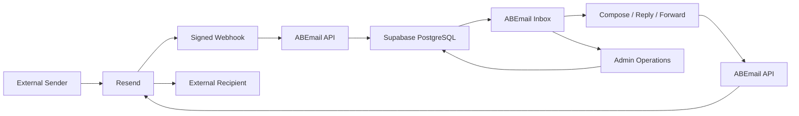

<div align="center">

# ✉️ ABEmail Mail

### A focused business email workspace for organization-owned domains.

<p>


</p>

**A lightweight organization-owned mail platform with a modern mailbox workspace and an operations console.**

</div>

---

## Overview

ABEmail Mail is a focused business email platform built for an organization that owns and operates its own domain and mailboxes.

The current production-oriented deployment is built for **ABE Tech Lab / Waste2Light**. The application is intentionally reusable as an organization-specific deployment: another organization can run its own isolated instance by providing its own domain, mailboxes, Supabase project, Resend configuration, Vercel project, environment variables, and operational settings.

ABEmail is **not currently a multi-tenant Software as a Service (SaaS) platform**. Each deployment is intended to represent one organization and its mail environment.

## What ABEmail provides

### Mail workspace

- Inbox and mailbox navigation
- All Mail
- Sent / My Sent
- Starred
- Trash
- Read and unread state
- Mark all visible mail as read
- Message search and filtering
- Message details and reading view
- Responsive desktop, tablet, and mobile experience
- Mobile navigation and controlled message scrolling

### Composition and message actions

- New message composition
- Reply
- Reply All
- Forward
- Multi-recipient sending for Reply All
- Safe quoted-message handling
- Attachment upload and delivery
- Attachment access for sent and received messages
- Draft creation, update, deletion, and autosave
- Duplicate-save protection for rapid autosave requests
- Attachment metadata preservation in drafts

### Email infrastructure

- Resend outbound email delivery
- Resend inbound email receiving
- Signed inbound webhook verification
- PostgreSQL-backed message persistence
- Delivery-event ingestion and storage support
- Bounce, delay, failure, complaint, and suppression tracking support
- Idempotent provider-event storage using provider event identifiers

### Authentication and access control

- Supabase Authentication
- Protected application routes
- Authenticated server-side APIs
- Mailbox-scoped data operations
- Server-side Admin authorization
- Organization-level Admin allowlist
- Row Level Security (RLS) for database tables and operational records

### ABE Tech Lab Operations Console

The current Waste2Light deployment includes an organization-level Admin console for operating the application.

- Overview dashboard
- Monitoring
- Incident management
- Security view
- Capacity and usage view
- Mailbox management
- User access management
- Subscription operations
- Read-only Admin audit log
- User problem reporting
- System-event tracking
- Incident and alert storage
- Scheduled health-check support
- Resend delivery-event monitoring

The Admin console is intended for the deployment owner/operator. It is separate from the future concept of a commercial multi-tenant ABEmail administration platform.

## Product architecture



### Runtime architecture

```text
Vercel
  │
  └── Next.js / React / TypeScript
        │
        ├── Supabase Auth
        ├── Supabase PostgreSQL
        │     ├── mailboxes
        │     ├── email_messages
        │     ├── drafts
        │     ├── attachments metadata
        │     ├── billing/subscription records
        │     └── Admin operations data
        │
        └── Resend
              ├── outbound delivery
              ├── inbound receiving
              ├── signed webhooks
              └── provider delivery events
```

## Mail flow

### Incoming mail

```text
External sender
      ↓
Resend inbound receiving
      ↓
Signed webhook
      ↓
ABEmail webhook endpoint
      ↓
Validate + normalize message
      ↓
Supabase PostgreSQL
      ↓
ABEmail mailbox
```

### Outgoing mail

```text
ABEmail compose / reply / forward
      ↓
Authenticated ABEmail API
      ↓
Resend
      ↓
External recipient
```

## Admin flow

Admin access uses the normal ABEmail authentication account. There is no separate Admin password.

```text
User signs in normally
        ↓
Server reads authenticated Supabase user
        ↓
Email is checked against ABEMAIL_ADMIN_EMAILS
        ↓
Admin access granted or denied
        ↓
/admin
```

The Admin authorization helper is server-side and the allowlist is read from the deployment environment.

## Current production baseline

The current `main` branch includes the core mail product and the Waste2Light ABE Tech Lab operations layer.

| Area | Status |
| --- | --- |
| Core mailbox | ✅ Implemented |
| Authentication | ✅ Implemented |
| Send / receive | ✅ Implemented |
| Reply / Reply All / Forward | ✅ Implemented |
| Attachments | ✅ Implemented |
| Drafts / autosave | ✅ Implemented |
| Search | ✅ Implemented |
| Mark all read | ✅ Implemented |
| Admin console | ✅ Merged into `main` |
| Admin database migrations | ✅ Applied to the Waste2Light Supabase project |
| Admin configuration | ✅ Production variables configured |
| Delivery-event storage | ✅ Implemented; provider event subscription remains deployment configuration |
| Web Push notifications | ⏸️ Parked for a later phase |
| Security hardening | 🟡 Separate branch / follow-up work |
| Gmail deliverability | 🟡 Operational follow-up |
| Cloudflare migration | ⏳ Future work |

## Technology stack

- **Next.js** for the application framework
- **React** for the user interface
- **TypeScript** for application code
- **Supabase Authentication** for user authentication
- **Supabase PostgreSQL** for application data
- **Supabase Storage** for private attachment storage
- **Resend** for email sending, receiving, webhooks, and delivery events
- **Vercel** for application deployment

## Repository structure

```text
app/                     Next.js routes, pages, APIs, and UI
components/              Interactive mail and Admin components
lib/                     Supabase, Resend, Admin, monitoring, and application helpers
supabase/migrations/     Database schema, policies, and operational migrations
public/                  Public application assets
docs/                    Product, operational, security, and implementation documentation
proxy.ts                 Request/authentication proxy
next.config.ts           Next.js configuration
package.json             Project dependencies and scripts
.env.example             Environment variable template
LICENSE                  Project license
```

## Local development

### Requirements

- Node.js 22+
- npm
- A Supabase project
- A Resend account/domain for actual send and receive testing

### Install

```bash
npm install
```

### Run locally

```bash
npm run dev
```

The app will normally be available at:

```text
http://localhost:3000
```

### Production build

```bash
npm run build
```

> The repository currently exposes `dev`, `build`, and `start` scripts. A dedicated automated test suite and `typecheck` script are planned as part of the remaining hardening work.

## Environment configuration

Create a local environment file from `.env.example`:

```bash
cp .env.example .env.local
```

### Required application variables

```text
NEXT_PUBLIC_SUPABASE_URL
NEXT_PUBLIC_SUPABASE_PUBLISHABLE_KEY
SUPABASE_SERVICE_ROLE_KEY

RESEND_API_KEY
RESEND_WEBHOOK_SECRET
RESEND_FROM_EMAIL

NEXT_PUBLIC_APP_URL
```

### Admin variables

```text
ABEMAIL_ADMIN_EMAILS
CRON_SECRET
```

`ABEMAIL_ADMIN_EMAILS` contains the email address or comma-separated list of email addresses allowed to use `/admin`.

`CRON_SECRET` protects scheduled health-check requests.

### Secrets

Never commit real values for:

- Supabase service-role credentials
- Resend API keys
- webhook signing secrets
- cron secrets
- mailbox passwords
- private provider credentials

Keep deployment-specific values in the hosting/provider environment rather than in source control.

## Supabase database setup

The repository uses ordered SQL migrations under `supabase/migrations/`.

The current production baseline includes:

```text
001_email_core.sql
002_correct_emmanuel_abah_email.sql
003_settings_notifications_billing.sql
004_email_drafts.sql
005_message_state.sql
006_attachments_storage.sql
007_admin_operations.sql
008_resend_delivery_events.sql
009_incident_alerts.sql
```

The Web Push migration is intentionally **not** part of the current production baseline and is parked for later work.

### Migration responsibilities

| Migration | Purpose |
| --- | --- |
| `001_email_core.sql` | Core mailboxes, messages, and foundational schema |
| `002_correct_emmanuel_abah_email.sql` | Mailbox address correction |
| `003_settings_notifications_billing.sql` | Settings, notification preferences, and subscription data |
| `004_email_drafts.sql` | Draft persistence |
| `005_message_state.sql` | Message-state fields and operations |
| `006_attachments_storage.sql` | Private attachment storage and metadata support |
| `007_admin_operations.sql` | Incidents, system events, issue reports, and Admin audit data |
| `008_resend_delivery_events.sql` | Resend delivery-event storage and message delivery metadata |
| `009_incident_alerts.sql` | Admin incident alerts and related operational structures |

Apply migrations in order. Do not run parked/future migrations unless the corresponding feature is intentionally being enabled.

## Resend setup

Each organization deployment needs its own Resend configuration.

At minimum, configure:

1. A verified sending domain
2. The application sender address
3. A Resend API key
4. The inbound receiving configuration required for the organization domain
5. The ABEmail webhook endpoint
6. The webhook signing secret
7. Delivery events required by the Admin monitoring layer

For the current deployment, the webhook endpoint is:

```text
https://mail.waste2light.com/api/webhooks/resend
```

When reusing ABEmail for another organization, replace organization-specific domains and addresses with the new deployment's values.

## Domain and DNS setup

A reusable deployment normally requires DNS records for:

- Mail-domain verification
- Sender authentication
- SPF (Sender Policy Framework)
- DKIM (DomainKeys Identified Mail)
- DMARC (Domain-based Message Authentication, Reporting, and Conformance)
- Inbound receiving where required by the mail provider
- The application domain pointing to the hosting provider

DNS records are organization-specific and must not be copied from the Waste2Light deployment.

## Deploying ABEmail for another organization

ABEmail can be reused as an organization-specific deployment rather than as a multi-tenant service.

### Recommended setup sequence

```text
1. Fork/clone the repository
2. Create an isolated Supabase project
3. Create the required Supabase Auth configuration
4. Apply the ordered database migrations
5. Create/configure the organization's Resend account and verified domain
6. Configure sending and inbound receiving
7. Configure the signed Resend webhook
8. Configure the organization's mailboxes
9. Create the Vercel project
10. Add environment variables
11. Set ABEMAIL_ADMIN_EMAILS for the organization operator
12. Set CRON_SECRET
13. Deploy
14. Run authentication and mailbox smoke tests
15. Run send and receive tests
16. Run Admin smoke tests
17. Validate DNS and email authentication
```

### What changes per organization

The following should be treated as deployment-specific:

- Domain names
- Mailbox addresses
- Supabase project
- Resend account
- Resend domain
- API keys and secrets
- Admin operator emails
- DNS records
- Vercel project
- Organization-specific data/seeds

The application code and UI should remain the same unless the deployment owner has intentionally licensed or authorized modifications.

## Branding and UI integrity

The official ABEmail deployment uses a defined interface, visual identity, terminology, and interaction model.

For official ABE Tech Lab / Waste2Light deployments:

- Do not replace or remove ABEmail branding
- Do not white-label the interface without written authorization
- Do not redesign or materially alter the user interface
- Do not remove copyright or attribution notices
- Keep the documented product identity and interaction patterns intact

### Important licensing note

The repository currently ships under the **MIT License**. The MIT License permits use, copying, modification, distribution, sublicensing, and sale, provided the required copyright and license notices are retained. Therefore, the README can state our preferred branding and UI policy, but **the current MIT License does not legally prevent a third party from modifying the UI**.

If the goal later becomes a legally enforceable rule such as “you may deploy this software but may not modify the UI, remove branding, white-label it, or resell it without a royalty agreement,” the license will need to be changed to a suitable proprietary or custom commercial license and the allowed-use terms should be defined explicitly.

See [`LICENSE`](./LICENSE) before granting any external reuse rights.

## Security model

ABEmail is designed around several security boundaries:

- Authentication through Supabase Auth
- Server-side authorization for sensitive operations
- Mailbox-scoped data access
- Row Level Security (RLS) on Supabase tables
- Server-side use of privileged Supabase credentials
- Signed webhook verification before accepting inbound provider events
- Private attachment storage with authenticated access
- Admin authorization through a server-side allowlist
- Administrative audit logging
- Incident and monitoring records separated from normal mailbox data

Security hardening is still an active engineering track and is kept separate from the current Admin merge.

## Operations and monitoring

The Waste2Light Admin console provides an operational layer over the mail platform.

### Monitoring signals

- Application/system events
- Mail flow volume
- Open incidents
- Outbound failures
- Resend delivery events
- User issue reports
- Scheduled health-check results
- DNS/email authentication signals

### Incident model

The Admin monitoring layer supports automatic incident creation from repeated or critical signals and records the associated operational history.

The design is intentionally provider-neutral so future Vercel, Supabase, and Cloudflare signals can feed the same operational model.

## Documentation

Detailed documentation is kept under [`docs/`](./docs):

```text
docs/
├── admin-operations-status.md
├── waste2light-admin-plan.md
├── security-checklist.md
├── UI-REFERENCE.md
└── web-push.md
```

The README is the deployment and product overview. Deeper provider setup, security work, and feature-specific implementation notes belong in `docs/`.

## Current limitations and future work

### Active follow-up

- Complete the remaining security-hardening work
- Add a real automated test suite and typecheck command
- Complete production role-boundary, failure-injection, and backup/recovery validation
- Finish Gmail deliverability investigation and authentication checks
- Enable/configure the Resend delivery-event subscriptions for the deployment operator

### Parked

**Web Push notifications** are implemented on `feature/web-push-v2` but intentionally parked. Do not apply the Web Push migration or configure VAPID (Voluntary Application Server Identification) keys unless this feature is explicitly reactivated.

### Future

- Deeper provider usage/health integrations
- Future Cloudflare runtime, routing, security, and service-health signals
- Potential commercial multi-tenant Admin platform as a separate product architecture

## Git workflow

The repository intentionally keeps a small branch set.

```text
main                      Current production-oriented baseline
feature/security-hardening Unmerged security work
feature/web-push-v2        Parked Web Push work
```

Completed feature branches are merged and removed to keep the repository history easier to navigate.

## License and ownership

ABEmail Mail is currently distributed under the **MIT License**. See [`LICENSE`](./LICENSE) for the complete terms and required copyright notice.

The current copyright holder named in the license is:

**Ayo Richard ABE [gODtECH]**

Because the code is MIT-licensed today, ownership of the copyright and the permissions granted by the license should not be confused with a claim that third-party deployments are prohibited from modifying the software.

For commercial reuse, white-labeling restrictions, royalties, attribution requirements beyond the MIT License, or other contractual conditions, use a separate written commercial license or agreement.

---

## Project principle

ABEmail should be reusable as a deployment pattern without becoming a generic, unbranded starter kit.

**Deploy it as the organization-owned mail platform it was designed to be, keep the security boundaries intact, keep deployment-specific secrets outside the repository, and preserve the product identity unless a separate license explicitly permits changes.**
