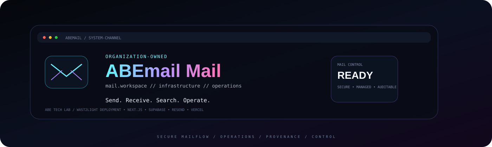
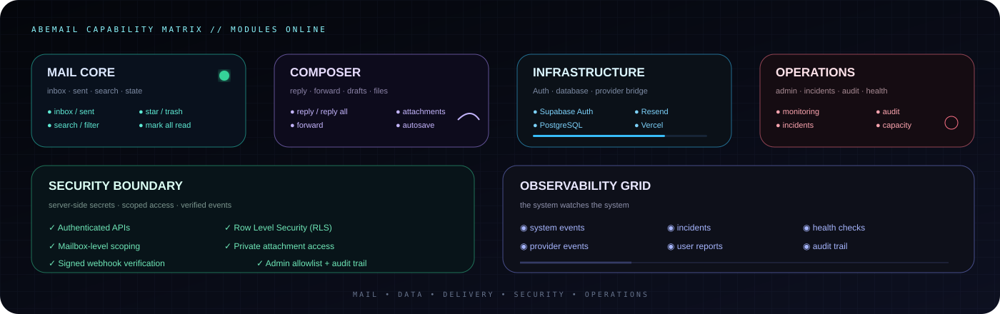
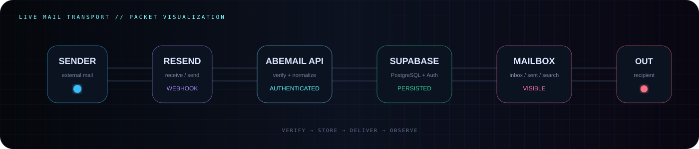
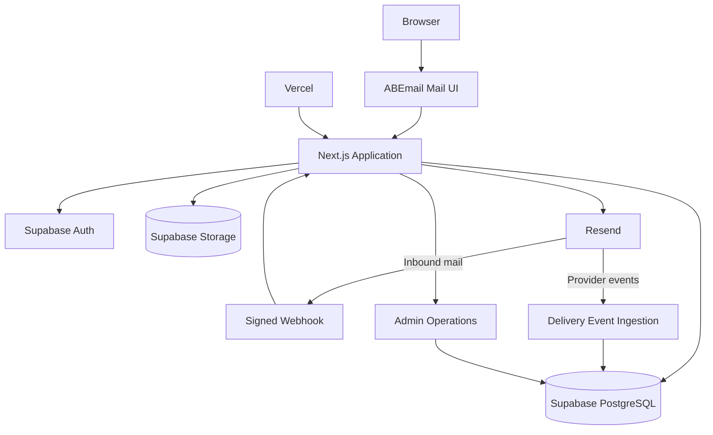

<a name="readme-top"></a>

<div align="center">



<p>
  
  
  
  
  
  
  
  
</p>

### Organization-owned business email, built as a deployable product.


<p>
  <a href="https://mail.waste2light.com">Live deployment</a> ·
  <a href="#features">Features</a> ·
  <a href="#architecture">Architecture</a> ·
  <a href="#deployment">Deployment</a> ·
  <a href="#security">Security</a> ·
  <a href="#licensing">Licensing</a>
</p>

</div>

---

## ⚡ The 30-second version

ABEmail Mail is a focused business email workspace for an organization that owns its domain and mailboxes. The current implementation powers the **ABE Tech Lab / Waste2Light** deployment.

It combines a modern mailbox interface with managed authentication, PostgreSQL persistence, private attachment storage, Resend email transport, and an organization-level operations console.

```text
ONE ORGANIZATION
      ↓
ONE ISOLATED DEPLOYMENT
      ↓
MAIL WORKSPACE + OPERATIONS CONSOLE
      ↓
SUPABASE + RESEND + VERCEL
```

ABEmail is **not currently a multi-tenant Software as a Service (SaaS) platform**. The intended reuse model is one isolated deployment per organization.

<a href="#readme-top">↑ back to top</a>

---

## ✨ Features

<div align="center">

</div>

### 📬 Mail workspace

| Capability | Included |
| --- | :---: |
| Inbox and mailbox navigation | ✅ |
| All Mail | ✅ |
| Sent / My Sent | ✅ |
| Starred | ✅ |
| Trash | ✅ |
| Read / unread state | ✅ |
| Mark all visible mail as read | ✅ |
| Message reading view | ✅ |
| Search and filtering | ✅ |
| Responsive desktop / tablet / mobile UI | ✅ |
| Mobile navigation drawer | ✅ |
| Controlled message scrolling | ✅ |

### ✍️ Composition

- New message composition
- Reply
- Reply All
- Forward
- Multi-recipient Reply All
- Safe quoted-message handling
- Attachment upload and delivery
- Secure attachment access
- Draft creation, update, deletion, and autosave
- Duplicate-save protection for rapid autosave requests
- Attachment metadata preservation in drafts

### 📡 Email infrastructure

- Resend outbound email delivery
- Resend inbound receiving
- Signed inbound webhook verification
- PostgreSQL-backed message persistence
- Provider delivery-event ingestion support
- Bounce, delay, failure, complaint, and suppression tracking
- Idempotent provider-event storage keyed by provider event identifiers

### 🛡️ Operations console

The Waste2Light deployment includes an organization-level Admin console:

```text
/admin
│
├── Overview
├── Monitoring
├── Incidents
├── Security
├── Capacity & Usage
├── Mailboxes
├── Users
├── Subscription
└── Audit Log
```

Capabilities include monitoring, incident management, user problem reporting, system events, delivery tracking, health checks, mailbox operations, user access operations, subscription operations, and administrative audit history.

### 🔐 Authentication and access control

- Supabase Authentication
- Protected routes
- Authenticated server-side Application Programming Interfaces (APIs)
- Mailbox-scoped operations
- Server-side Admin authorization
- Organization-level Admin allowlist
- Row Level Security (RLS)
- Private attachment storage
- Administrative audit records

<a href="#readme-top">↑ back to top</a>

---

## 🌀 Live mail-flow visualization

<div align="center">

</div>

The flow is deliberately simple:

```text
                        ┌───────────────────┐
                        │  External sender  │
                        └─────────┬─────────┘
                                  ↓
                           ┌─────────────┐
                           │    Resend   │
                           └──────┬──────┘
                                  ↓
                         signed webhook
                                  ↓
                      ┌────────────────────┐
                      │    ABEmail API     │
                      └─────────┬──────────┘
                                ↓
                    ┌────────────────────────┐
                    │ Supabase PostgreSQL    │
                    └───────────┬────────────┘
                                ↓
                         ┌──────────────┐
                         │   Mailbox    │
                         └──────────────┘
```

Outgoing mail travels back through the authenticated ABEmail API and Resend to the external recipient.

---

## 🧠 Architecture

<a name="architecture"></a>



### ⚙️ Technology stack

<p align="center">
  
</p>

| Layer | Technology | Role |
| --- | --- | --- |
| Framework | Next.js | Application framework, routing, server APIs |
| UI | React | Mail workspace and Admin interface |
| Language | TypeScript | Type-safe application code |
| Authentication | Supabase Auth | Identity and sessions |
| Database | Supabase PostgreSQL | Mail, drafts, events, Admin records |
| Storage | Supabase Storage | Private attachments |
| Email | Resend | Send, receive, webhooks, provider events |
| Hosting | Vercel | Deployment and scheduled jobs |

---

## 🏗️ Internal system map

```text
                             ABEMAIL
                                │
            ┌───────────────────┴───────────────────┐
            │                                       │
     MAIL WORKSPACE                          OPERATIONS LAYER
            │                                       │
     ┌──────┼───────┐                       ┌───────┼────────┐
     │      │       │                       │       │        │
   Inbox  Compose  Search                 Monitor Incidents Audit
     │      │       │                       │       │        │
     └──────┴───────┘                       └───────┴────────┘
            │                                       │
            └──────────────────┬────────────────────┘
                               ↓
                        SUPABASE DATA
                               │
                ┌──────────────┼──────────────┐
                │              │              │
              Auth         PostgreSQL       Storage
                │              │              │
                └──────────────┴──────┬───────┘
                                      ↓
                                    RESEND
                                      │
                           external mail network
```

---

## 📊 Current product status

```text
CORE MAIL                  ████████████████████  COMPLETE
AUTHENTICATION             ████████████████████  COMPLETE
SEND / RECEIVE             ████████████████████  COMPLETE
REPLY / FORWARD            ████████████████████  COMPLETE
ATTACHMENTS                ████████████████████  COMPLETE
DRAFTS / AUTOSAVE          ████████████████████  COMPLETE
SEARCH                     ████████████████████  COMPLETE
ADMIN CONSOLE              ████████████████████  MERGED
ADMIN DATABASE             ████████████████████  APPLIED
ADMIN VALIDATION           ███████████████░░░░░  ACTIVE FOLLOW-UP
SECURITY HARDENING         ██████████░░░░░░░░░░  FOLLOW-UP
GMAIL DELIVERABILITY       ██████████░░░░░░░░░░  FOLLOW-UP
AUTOMATED TEST SUITE       █████░░░░░░░░░░░░░░░  FOLLOW-UP
WEB PUSH                   ███████████████░░░░░  PARKED
CLOUDFLARE MIGRATION       ██░░░░░░░░░░░░░░░░░░  FUTURE
COMMERCIAL LICENSING       ██░░░░░░░░░░░░░░░░░░  FUTURE
```

### Current branches

```text
main
├── feature/security-hardening   # active unmerged hardening work
└── feature/web-push-v2          # intentionally parked notification work
```

Completed feature branches are removed after their work is merged or superseded.

---

## 🚀 Local development

### Requirements

- Node.js 22+
- npm
- A Supabase project
- A Resend account and verified domain for real email testing

### Install

```bash
npm install
```

### Start development

```bash
npm run dev
```

Then open:

```text
http://localhost:3000
```

### Production build

```bash
npm run build
```

> The current repository exposes `dev`, `build`, and `start` scripts. Dedicated `typecheck` and automated test scripts remain part of the hardening backlog.

---

## 🔑 Environment configuration

Create a local environment file from the template:

```bash
cp .env.example .env.local
```

### Core application variables

```text
NEXT_PUBLIC_SUPABASE_URL
NEXT_PUBLIC_SUPABASE_PUBLISHABLE_KEY
SUPABASE_SERVICE_ROLE_KEY

RESEND_API_KEY
RESEND_WEBHOOK_SECRET
RESEND_FROM_EMAIL

NEXT_PUBLIC_APP_URL
```

### Admin variables

```text
ABEMAIL_ADMIN_EMAILS
CRON_SECRET
```

`ABEMAIL_ADMIN_EMAILS` controls who may enter `/admin`.

`CRON_SECRET` authenticates scheduled health-check requests.

Never commit:

- Supabase service-role credentials
- Resend API keys
- webhook signing secrets
- cron secrets
- mailbox passwords
- private provider credentials

Use Vercel or another secrets manager for deployment values.

---

## 🗄️ Supabase database

The current production baseline uses ordered migrations:

```text
001_email_core.sql
002_correct_emmanuel_abah_email.sql
003_settings_notifications_billing.sql
004_email_drafts.sql
005_message_state.sql
006_attachments_storage.sql
007_admin_operations.sql
008_resend_delivery_events.sql
009_incident_alerts.sql
```

| Migration | Purpose |
| --- | --- |
| `001_email_core.sql` | Core mailbox and message schema |
| `002_correct_emmanuel_abah_email.sql` | Mailbox address correction |
| `003_settings_notifications_billing.sql` | Settings, notification preferences, subscription data |
| `004_email_drafts.sql` | Draft persistence |
| `005_message_state.sql` | Message-state operations |
| `006_attachments_storage.sql` | Private attachment storage and metadata |
| `007_admin_operations.sql` | Incidents, system events, reports, Admin audit data |
| `008_resend_delivery_events.sql` | Resend provider delivery-event storage |
| `009_incident_alerts.sql` | Incident alert and operational structures |

Apply migrations in order. **Do not apply the parked Web Push migration unless Web Push is intentionally reactivated.**

---

## 📮 Resend setup

Each organization deployment needs its own Resend configuration.

Configure:

1. A verified sending domain
2. The organization's sender address
3. A Resend API key
4. Inbound receiving
5. The ABEmail webhook endpoint
6. The webhook signing secret
7. Delivery events used by the Admin monitoring layer

Current Waste2Light webhook:

```text
https://mail.waste2light.com/api/webhooks/resend
```

When reusing ABEmail, replace the domain, sender address, and endpoint with the new organization's values.

---

## 🌍 Domain and DNS

A deployment normally requires Domain Name System (DNS) records for:

- domain verification
- Sender Policy Framework (SPF)
- DomainKeys Identified Mail (DKIM)
- Domain-based Message Authentication, Reporting, and Conformance (DMARC)
- inbound mail routing where required
- application-domain hosting

DNS records are organization-specific. Never copy the Waste2Light records into another deployment unchanged.

---

## 🏢 Deploying ABEmail for another organization

ABEmail is designed to be reusable as an **isolated organization deployment**.

```text
01  Clone / fork the repository
02  Create an isolated Supabase project
03  Configure Supabase Authentication
04  Apply the ordered migrations
05  Create/configure the organization's Resend account
06  Verify the organization's mail domain
07  Configure sending and inbound receiving
08  Configure the signed webhook
09  Configure mailboxes
10  Create the hosting project
11  Add environment variables
12  Set the organization's Admin email(s)
13  Set CRON_SECRET
14  Deploy
15  Test authentication and mailbox isolation
16  Test send and receive
17  Test attachments and drafts
18  Test Admin permissions and operations
19  Validate DNS and mail authentication
20  Complete production smoke and recovery checks
```

### Deployment-specific values

```text
Domain names
Mailbox addresses
Supabase project
Resend account and domain
API keys and secrets
Admin email(s)
CRON_SECRET
DNS records
Hosting project
Organization seed data
```

The application UI and codebase represent the ABEmail product. Organization-specific configuration belongs in deployment variables and infrastructure rather than source edits.

---

## 🎨 Brand and UI integrity

ABEmail is intentionally designed as a product, not as an unbranded starter kit.

For official ABE Tech Lab / Waste2Light deployments, the intended policy is:

```text
KEEP THE BRAND.
KEEP THE UI.
KEEP THE TERMINOLOGY.
KEEP THE PRODUCT IDENTITY.
KEEP THE SECURITY BOUNDARIES.
```

Do not, without authorization:

- remove ABEmail branding
- white-label the interface
- materially redesign the user interface
- remove copyright or license notices
- present a modified deployment as an official ABEmail build

### Current legal position

The repository currently carries the **MIT License**, which is permissive and allows modification, redistribution, sublicensing, and commercial use subject to its notice requirements.

Therefore, the branding/UI rules above are currently **product policy and deployment guidance**, not restrictions created by the present MIT license.

Before controlled external commercial distribution, the licensing model should be deliberately replaced with a suitable proprietary or commercial agreement.

---

## 🧱 Licensing and extreme protection roadmap

The long-term protection model can be layered rather than relying on one trick:

```text
COPYRIGHT OWNERSHIP
        ↓
PROPRIETARY / COMMERCIAL LICENSE
        ↓
PERMITTED-USE DEFINITION
        ↓
BRAND + UI RESTRICTIONS
        ↓
NO UNAUTHORIZED WHITE-LABELING
        ↓
NO UNAUTHORIZED RESALE / SUBLICENSING
        ↓
DEPLOYMENT REGISTRATION
        ↓
LICENSE ACTIVATION / ENTITLEMENT
        ↓
SIGNED RELEASES + PROVENANCE
        ↓
SOFTWARE BILL OF MATERIALS (SBOM)
        ↓
COMMERCIAL FEES / ROYALTIES WHERE CONTRACTED
        ↓
TERMINATION + BREACH REMEDIES
```

Potential technical provenance mechanisms include:

- signed releases
- copyright and provenance markers
- build metadata
- Software Bill of Materials (SBOM)
- version identifiers
- deployment identifiers
- license activation records
- entitlement/version tracking
- explicitly disclosed license-validation services

No source-code mechanism can make an identifier literally impossible to remove from a copy that another party fully controls. Likewise, arbitrary independent deployments cannot be reliably discovered without a legitimate observable connection or contractual reporting mechanism.

The strongest practical model is **legal protection + controlled distribution + technical provenance + explicit activation and entitlement controls**.

---

## 🔐 Security

<a name="security"></a>

ABEmail is designed around layered security boundaries:

- Supabase Authentication for identity
- Server-side authorization for sensitive operations
- Mailbox-scoped data access
- Row Level Security (RLS)
- Server-side privileged database access
- Signed Resend webhook verification
- Private attachment storage
- Admin authorization through a server-side allowlist
- Administrative audit logging
- Incident and monitoring records separated from normal mailbox data

The dedicated `feature/security-hardening` branch contains additional unmerged hardening work and should be reviewed before final production sign-off.

---

## 🛰️ Operations and monitoring

The Admin console turns the mail workspace into an operable service rather than only a user interface.

### Monitored signals

- application/system events
- mail-flow volume
- outbound failures
- Resend delivery events
- user issue reports
- open incidents
- scheduled health-check results
- DNS and email-authentication signals

### Incident model

Critical and repeated signals can be correlated into P1, P2, or P3 incidents with operational history and alert records.

The monitoring model is provider-neutral so future Vercel, Supabase, and Cloudflare signals can feed the same operational system.

---

## 🧪 Validation and production readiness

Current validation priorities:

```text
[1] Admin login and access boundary
[2] Admin user and mailbox operations
[3] Incident lifecycle
[4] Audit logging
[5] Scheduled health checks
[6] Resend send / receive verification
[7] Gmail deliverability
[8] Role-boundary testing
[9] Failure-injection testing
[10] Backup / recovery validation
[11] Automated test suite + typecheck
```

The Web Push notification work is intentionally excluded from this readiness sequence and remains parked on `feature/web-push-v2`.

---

## 📚 Repository structure

```text
app/                     Next.js routes, pages, APIs, and UI
components/              Interactive mail and Admin components
lib/                     Supabase, Resend, Admin, monitoring, and app helpers
public/                  Public assets
docs/                    Product, operational, security, and visual documentation
  assets/                Local animated README SVGs
supabase/migrations/     Ordered database schema and policy migrations
proxy.ts                 Request/authentication proxy
next.config.ts           Next.js configuration
package.json             Dependencies and scripts
.env.example             Environment template
LICENSE                  Current license
```

### README visual assets

The README intentionally uses project-owned animated SVGs:

```text
docs/assets/abemail-hero.svg
   ↳ animated hero / product identity

docs/assets/abemail-flow.svg
   ↳ animated mail transport visualization

docs/assets/abemail-matrix.svg
   ↳ animated capability matrix

docs/assets/abemail-footer.svg
   ↳ animated transmission footer
```

This keeps the more unusual visual treatment close to the repository rather than making the README dependent on a collection of random third-party GIFs.

---

## 🧩 Documentation map

```text
docs/
├── admin-operations-status.md
├── waste2light-admin-plan.md
├── security-checklist.md
├── UI-REFERENCE.md
└── web-push.md
```

The README is the product and deployment front door. Feature-specific implementation details belong under `docs/`.

---

## ⏸️ Parked work

### Web Push notifications

Implemented on `feature/web-push-v2`, but intentionally parked.

Do not:

- apply the Web Push database migration
- configure VAPID (Voluntary Application Server Identification) keys
- merge the Web Push branch

until notification work is explicitly reactivated.

### Cloudflare migration

Future infrastructure work. Vercel remains the current application runtime.

### Commercial multi-tenant Admin platform

A possible future product architecture. The current Admin console is specifically for the deployment owner/operator and is not the commercial multi-tenant Admin product.

---

## 🧭 Design philosophy

ABEmail is meant to feel like a real product while staying straightforward to deploy:

```text
SIMPLE FOR USERS
        +
CONTROLLED FOR OPERATORS
        +
REUSABLE FOR DEPLOYMENTS
        +
EXPLICIT ABOUT SECURITY
        +
CAREFUL ABOUT PROVENANCE
```

The goal is not to recreate a traditional mail-server stack. The goal is to provide a focused organization-owned mail experience with an operational control plane around it.

---

<div align="center">


### ✉️ ABEmail Mail

**Organization-owned. Deployment-ready. Built with intent.**

<sub>ABE Tech Lab / gODtECH</sub>

</div>

<a href="#readme-top">↑ back to top</a>

---

## 📄 License

ABEmail Mail currently ships under the **MIT License**. See [`LICENSE`](./LICENSE) for the complete terms.

The current copyright holder named in that file is **Ayo Richard ABE [gODtECH]**.

For stronger restrictions around branding, white-labeling, modification, commercial reuse, royalties, or deployment entitlements, adopt a separate proprietary/commercial license before external distribution.