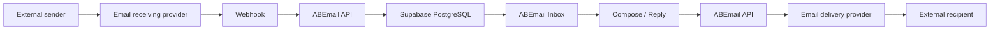

<div align="center">

# ✉️ ABEmail Mail

### A lightweight business email workspace built around customer-owned domains.

<p>


</p>

**A simple mail experience backed by modern email infrastructure.**

</div>

---

## 🧭 Product vision

ABEmail Mail is designed to provide a focused business email experience without requiring a full traditional mail server stack.

The application combines a responsive mailbox interface with managed authentication, application data storage, and an email delivery and receiving provider.

It is designed to be reusable across deployments, while keeping organization-specific infrastructure and credentials outside the public codebase.

<table>
<tr><td width="50%">

### 📥 Mailbox workspace
Inbox, Sent, message reading, search, and mailbox navigation.

### ✍️ Composition
Responsive message composition with reply and forward flows.

### 📱 Responsive UI
Desktop, tablet, and mobile layouts built around familiar mail-client patterns.

</td><td width="50%">

### 🔐 Authentication
Email/password authentication with protected application routes.

### 📡 Email infrastructure
Integration with Resend for outbound delivery, inbound receiving, and webhooks.

### 🗃️ Data layer
Supabase Auth and PostgreSQL for users, mailboxes, and message persistence.

</td></tr>
</table>

## 🔄 Mail flow



## ✅ Current foundation

- Responsive ABEmail mailbox workspace
- Supabase email/password authentication
- Protected application routes and authenticated APIs
- Inbox and Sent views
- Search and message filtering
- Message reader with reply and forward actions
- Responsive compose experience
- Resend outbound email integration
- Resend inbound receiving webhook
- Signed webhook verification
- Supabase PostgreSQL message persistence
- Vercel deployment support
- Mobile navigation and controlled message scrolling

<details>
<summary><strong>🎯 Minimum Viable Product (MVP) direction</strong></summary>

1. Stable mailbox access and authentication
2. Send and receive business email
3. Message history and search
4. Reply and forward workflows
5. Reliable responsive experience across devices
6. Deployment configuration for customer domains
7. Administrative mailbox management

</details>

## 🏗️ Architecture

```text
Vercel
  │
  └── Next.js / React / TypeScript
        │
        ├── Supabase Auth
        ├── Supabase PostgreSQL
        │
        └── Resend
              ├── outbound email
              ├── inbound email
              └── webhooks
```

Customer-specific domains, addresses, API keys, webhook secrets, and environment values are configured outside the repository and are intentionally not documented here.

## 🗂️ Repository map

```text
app/                     Next.js application routes and UI
lib/                     Supabase and application helpers
supabase/migrations/     Database schema and security policies
public/                  Public application assets
docs/                    Product and implementation documentation
```

## 🚀 Local development

Requirements: Node.js 22+ and npm.

```bash
npm install
npm run dev
npm run typecheck
npm test
npm run build
```

Copy `.env.example` to `.env.local` and provide the required Supabase and Resend values.

Never commit API keys, service-role credentials, webhook secrets, mailbox passwords, or customer-specific DNS configuration.

## 🔐 Security principles

ABEmail should keep application secrets server-side and use authenticated access for mailbox operations.

Webhook payloads must be verified before messages are persisted. Database access should remain protected by Row Level Security (RLS), and customer-specific infrastructure details should stay outside public documentation.

## 📌 Delivery status

The repository currently represents the first production-oriented MVP foundation. Email domain activation, DNS configuration, and customer-specific infrastructure setup are deployment concerns rather than hard-coded application configuration.

## 🔒 Ownership

ABEmail Mail is proprietary software and product documentation. See [`LICENSE`](./LICENSE) for usage terms.
